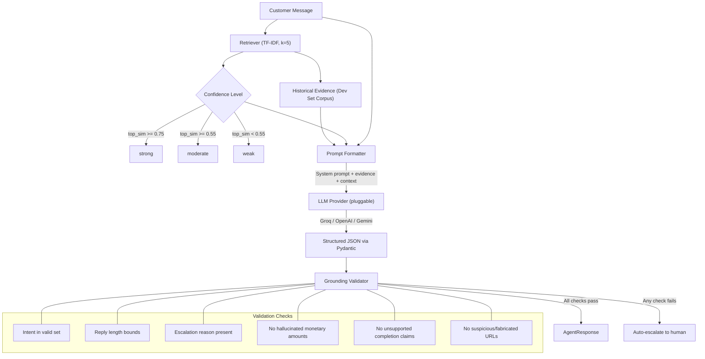
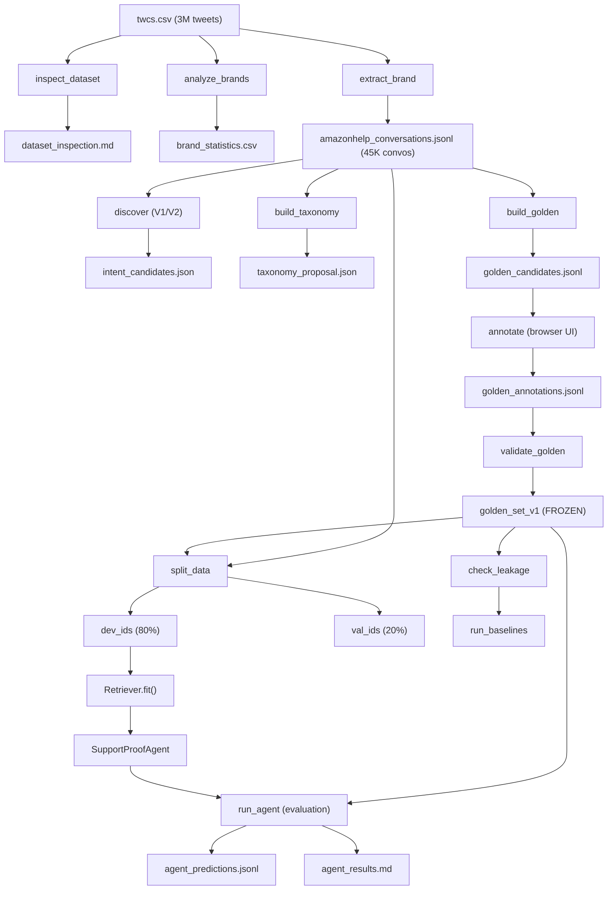

# 🛡️ SupportProof

**AI Customer-Support Agent Built from Real Twitter Conversations**

[](#prerequisites)
[](#license)
[](#stage-8--golden-evaluation-set)

> *SupportProof is an end-to-end NLP pipeline that transforms raw Twitter customer-support conversations into a production-grade, RAG-powered support agent with deterministic safety validation, human-annotated evaluation, and rigorous anti-leakage methodology.*

---

## Table of Contents

- [Overview](#overview)
- [Architecture](#architecture)
- [Pipeline Stages](#pipeline-stages)
- [Project Structure](#project-structure)
- [Getting Started](#getting-started)
- [Configuration](#configuration)
- [Workflows & Commands](#workflows--commands)
- [Data Flow](#data-flow)
- [Evaluation Methodology](#evaluation-methodology)
- [Intent Taxonomy](#intent-taxonomy)
- [Testing](#testing)
- [Reports](#reports)
- [License](#license)

---

## Overview

SupportProof takes the [Twitter Customer Support dataset (TWCS)](https://www.kaggle.com/datasets/thoughtvector/customer-support-on-twitter) — ~3M tweets from major brands — and builds a fully evaluated AI support agent through an 11-stage pipeline:

1. **Explore** — Understand the raw dataset characteristics
2. **Select** — Identify the best brand (AmazonHelp) by data quality
3. **Reconstruct** — Thread raw tweets into multi-turn conversations
4. **Classify** — Build an intent taxonomy from real data patterns
5. **Retrieve** — Implement TF-IDF retrieval for historical resolution evidence
6. **Respond** — Build an LLM-powered agent with RAG grounding
7. **Safeguard** — Deterministic validation to catch hallucinations
8. **Annotate** — 200-example human-labelled golden evaluation set
9. **Evaluate** — Automated metrics (precision, recall, F1, accuracy)
10. **Judge** — LLM-as-judge qualitative evaluation
11. **Analyze** — Systematic failure analysis and error categorization

---

## Architecture



---

## Pipeline Stages

### Stage 1 · Dataset Inspection

Loads the raw TWCS dataset and produces summary statistics (total tweets, unique authors, brands, response rate distributions).

```bash
python -m src.data.inspect_dataset
```

| Input | Output |
|:------|:-------|
| `data/raw/twcs.csv` | `reports/dataset_inspection.md` |

---

### Stage 2 · Brand Analysis & Selection

Streams through the entire dataset, infers brand identities from outbound accounts, reconstructs conversation threads, and ranks brands by usable support-data quality.

```bash
python -m src.data.analyze_brands
```

| Input | Output |
|:------|:-------|
| `data/raw/twcs.csv` | `data/processed/brand_statistics.csv` |
| | `reports/brand_analysis.md` |

**Result:** AmazonHelp selected as the target brand due to highest volume of multi-turn, high-quality support conversations.

---

### Stage 3 · Conversation Reconstruction

Two-pass memory-efficient extraction that threads raw tweet IDs into complete multi-turn customer-brand conversations for AmazonHelp.

```bash
python -m src.data.extract_brand
```

| Input | Output |
|:------|:-------|
| `data/raw/twcs.csv` | `data/processed/amazonhelp_conversations.jsonl` |
| | `data/processed/amazonhelp_conversations.csv` |
| | `reports/amazonhelp_conversation_analysis.md` |

---

### Stage 4 · Intent Taxonomy

Builds a human-reviewable operational taxonomy using unsupervised clustering (TF-IDF + cosine similarity) on real customer messages. Three iterations of progressive refinement:

```bash
# V1: Initial intent discovery
python -m src.intent.discover

# V2: Refined clustering with improved tokenization
python -m src.intent.discover_v2

# V3: Final operational taxonomy with strict boundaries
python -m src.intent.build_taxonomy
```

| Input | Output |
|:------|:-------|
| `data/processed/amazonhelp_conversations.jsonl` | `data/processed/intent_candidates.json` |
| | `data/processed/intent_candidates_v2.json` |
| | `data/processed/taxonomy_proposal.json` |
| | `reports/intent_discovery.md` |
| | `reports/intent_discovery_v2.md` |
| | `reports/taxonomy_review.md` |

**Final taxonomy:** 11 intents — `technical_issue`, `refund_request`, `delivery_delay`, `account_prime`, `order_tracking`, `return_request`, `issue_with_received_item`, `missing_delivery`, `gift_card_promotion`, `cancel_order`, `other_or_unclear`.

---

### Stage 5 · Data Splitting

Deterministic 80/20 train/validation split with strict golden-set quarantine and text-level leakage detection.

```bash
python -m src.evaluation.split_data
```

| Input | Output |
|:------|:-------|
| `data/processed/amazonhelp_conversations.jsonl` | `data/processed/development_conversation_ids.txt` |
| `data/golden/golden_set_v1.csv` | `data/processed/validation_conversation_ids.txt` |
| | `data/processed/golden_conversation_ids.txt` |

---

### Stage 6 · Historical-Resolution Retrieval

The `Retriever` class builds a TF-IDF index over the development set and retrieves the top-k most similar historical conversations for any new customer message. Confidence levels:

| Confidence | Top Similarity |
|:-----------|:---------------|
| **strong** | >= 0.75 |
| **moderate** | >= 0.55 |
| **weak** | < 0.55 |

Used internally by the agent — no standalone CLI command needed.

---

### Stage 7 · SupportProof Agent v0

RAG-powered support agent with structured LLM output and deterministic grounding validation.

```bash
# Interactive CLI
python -m src.agent.run_agent
```

**Key safety features:**
- Validates intent against the approved 11-intent taxonomy
- Rejects hallucinated monetary amounts not in evidence
- Catches unsupported claims of completed actions
- Blocks fabricated URLs
- Auto-escalates to human agent on any validation failure

---

### Stage 8 · Golden Evaluation Set

200 real customer conversations sampled via stratified deterministic heuristic sampling (seed: 42) with strict deduplication. 100% human-labelled for intent and escalation.

```bash
# Sample candidates
python -m src.evaluation.build_golden

# Human annotation (browser-based tool at http://localhost:8080)
python -m src.evaluation.annotate

# Validate and freeze
python -m src.evaluation.validate_golden
```

| Step | Output |
|:-----|:-------|
| Sampling | `data/golden/golden_candidates.jsonl`, `reports/golden_sampling.md` |
| Annotation | `data/golden/golden_annotations.jsonl`, `data/golden/golden_set.csv` |
| Freeze | `data/golden/golden_set_v1.jsonl`, `data/golden/golden_set_v1.csv` |

> **IMPORTANT:** The golden set is strictly held out from ALL training, tuning, or prompt-engineering feedback loops. See `data/golden/GOLDEN_SET_V1.md`.

---

### Stage 9 · Baseline & Agent Evaluation

```bash
# Data leakage check (run first!)
python -m src.evaluation.check_leakage

# Majority + TF-IDF baselines
python -m src.evaluation.run_baselines

# SupportProof Agent evaluation
python -m src.evaluation.run_agent

# 20-example pilot run (for fast iteration)
python -m src.evaluation.run_agent --pilot

# Resume after rate-limit interruption
python -m src.evaluation.run_agent --resume
```

| Output | Description |
|:-------|:------------|
| `reports/baseline_results.md` | Majority & TF-IDF baseline metrics |
| `reports/agent_results_v0.md` | Agent v0 full evaluation report |
| `data/processed/agent_predictions.jsonl` | Raw prediction output |

**Rate-limit handling:** The Groq API enforces a 200,000 TPD limit. The evaluation runner supports safe checkpointing — if a `429 Rate Limit` error occurs, progress is saved and can be resumed with `--resume` without duplicating work or mixing configurations.

---

### Stage 10 · LLM-as-Judge Evaluation

Automated qualitative evaluation of agent replies using a second LLM call, assessing empathy, evidence correctness, and safety adherence.

```bash
python -m src.evaluation.llm_judge
```

| Output | Description |
|:-------|:------------|
| `data/processed/judge_results_v1.1.jsonl` | Per-example judge evaluations |
| `reports/judge_results_v1.1.md` | Aggregate judge report |

Supports checkpoint-based resume for handling API rate limits.

---

### Stage 11 · Analysis & Iteration

Qualitative failure analysis and error categorization are documented in the reports directory:

| Report | Description |
|:-------|:------------|
| `reports/agent_v0_error_analysis.md` | Systematic error categorization |
| `reports/agent_v1_escalation_policy_analysis.md` | Escalation policy tuning |
| `reports/agent_v1_retrieval_fix.md` | Retrieval parameter improvements |
| `reports/agent_v1_retrieval_sanity.md` | Retrieval sanity checks |
| `reports/agent_v1_1_checkpoint_design.md` | Checkpoint/resume design doc |
| `reports/agent_v1_1_evaluation_plan.md` | Evaluation methodology plan |

---

## Project Structure

```
supportproof/
├── src/
│   ├── __init__.py
│   ├── agent/                          # Stage 6-7: RAG Agent
│   │   ├── agent.py                    # SupportProofAgent core with grounding validation
│   │   ├── prompts.py                  # System prompt and prompt formatter
│   │   ├── providers.py                # Pluggable LLM backends (Gemini, OpenAI, Groq)
│   │   ├── retriever.py                # TF-IDF retriever over dev-set corpus
│   │   ├── run_agent.py                # Interactive CLI runner
│   │   └── schemas.py                  # Pydantic schemas (AgentRequest, AgentResponse)
│   ├── data/                           # Stages 1-3: Data Processing
│   │   ├── __init__.py
│   │   ├── inspect_dataset.py          # Dataset summary statistics
│   │   ├── analyze_brands.py           # Brand ranking and selection
│   │   └── extract_brand.py            # Conversation reconstruction
│   ├── evaluation/                     # Stages 8-11: Evaluation
│   │   ├── annotate.py                 # Browser-based annotation tool
│   │   ├── build_golden.py             # Golden set sampling
│   │   ├── validate_golden.py          # Golden set validation and freeze
│   │   ├── split_data.py               # Dev/Val/Golden split with leakage check
│   │   ├── check_leakage.py            # Standalone leakage verification
│   │   ├── baseline_majority.py        # Majority-class baseline
│   │   ├── baseline_tfidf.py           # TF-IDF nearest-neighbor baseline
│   │   ├── run_baselines.py            # Baseline evaluation runner
│   │   ├── run_agent.py                # Agent evaluation (--resume, --pilot)
│   │   └── llm_judge.py                # LLM-as-judge qualitative evaluation
│   └── intent/                         # Stage 4: Intent Taxonomy
│       ├── discover.py                 # V1 unsupervised intent clustering
│       ├── discover_v2.py              # V2 refined clustering
│       └── build_taxonomy.py           # V3 final taxonomy builder
├── tests/                              # Comprehensive test suite
│   ├── test_extract_brand.py
│   ├── test_discover.py
│   ├── test_discover_v2.py
│   ├── test_build_taxonomy.py
│   ├── test_build_golden.py
│   ├── test_annotate.py
│   ├── test_validate_golden.py
│   ├── test_baselines.py
│   ├── test_agent.py
│   └── test_run_agent.py
├── requirements.txt                    # Python dependencies
├── LICENSE                             # MIT License
├── data/
│   ├── raw/                            # Original TWCS dataset (not committed)
│   │   └── twcs.csv
│   ├── processed/                      # Pipeline outputs
│   │   ├── amazonhelp_conversations.jsonl
│   │   ├── amazonhelp_conversations.csv
│   │   ├── brand_statistics.csv
│   │   ├── taxonomy_proposal.json
│   │   ├── development_conversation_ids.txt
│   │   ├── validation_conversation_ids.txt
│   │   ├── golden_conversation_ids.txt
│   │   └── agent_predictions.jsonl
│   └── golden/                         # Frozen evaluation set
│       ├── GOLDEN_SET_V1.md
│       ├── ANNOTATION_GUIDE.md
│       ├── golden_set_v1.jsonl
│       ├── golden_set_v1.csv
│       ├── golden_candidates.jsonl
│       └── golden_annotations.jsonl
├── reports/                            # Auto-generated analysis reports
├── .env.example                        # Environment variable template
├── .gitignore
└── README.md
```

---

## Getting Started

### Prerequisites

- **Python 3.10+**
- **pip** (package manager)

### Installation

```bash
# Clone the repository
git clone https://github.com/sanjaim25/proof.git
cd proof

# Create a virtual environment
python -m venv .venv

# Activate it
# Windows (PowerShell)
.venv\Scripts\Activate.ps1
# macOS/Linux
source .venv/bin/activate

# Install dependencies
pip install -r requirements.txt
```

### Dataset

Download the [TWCS dataset](https://www.kaggle.com/datasets/thoughtvector/customer-support-on-twitter) and place `twcs.csv` in `data/raw/`:

```
data/raw/twcs.csv
```

---

## Configuration

Copy the example environment file and configure your API keys:

```bash
cp .env.example .env
```

```env
# Provider selection: "openai", "gemini", or "groq"
LLM_PROVIDER=groq

# Groq (current evaluation provider)
GROQ_API_KEY=your-key-here
GROQ_MODEL=openai/gpt-oss-20b

# OpenAI (alternative)
OPENAI_API_KEY=your-key-here
OPENAI_MODEL=gpt-5.6-luna

# Gemini (alternative)
GEMINI_API_KEY=your-key-here
GEMINI_MODEL=gemini-3.6-flash
```

Only the provider specified in `LLM_PROVIDER` requires a valid API key.

---

## Workflows & Commands

### Complete Pipeline (End-to-End)

```bash
# -- Data Pipeline --
python -m src.data.inspect_dataset          # Stage 1: Explore dataset
python -m src.data.analyze_brands           # Stage 2: Rank brands
python -m src.data.extract_brand            # Stage 3: Extract AmazonHelp

# -- Intent Discovery --
python -m src.intent.discover               # Stage 4a: V1 clustering
python -m src.intent.discover_v2            # Stage 4b: V2 refined
python -m src.intent.build_taxonomy         # Stage 4c: Final taxonomy

# -- Evaluation Setup --
python -m src.evaluation.build_golden       # Stage 8a: Sample golden set
python -m src.evaluation.annotate           # Stage 8b: Annotate (browser UI)
python -m src.evaluation.validate_golden    # Stage 8c: Freeze golden set
python -m src.evaluation.split_data         # Stage 5: Dev/Val split

# -- Baselines --
python -m src.evaluation.check_leakage      # Verify zero leakage
python -m src.evaluation.run_baselines      # Majority + TF-IDF baselines

# -- Agent --
python -m src.agent.run_agent               # Interactive agent CLI
python -m src.evaluation.run_agent          # Full golden-set evaluation
python -m src.evaluation.run_agent --pilot  # Quick 20-example pilot
python -m src.evaluation.run_agent --resume # Resume after rate limit

# -- LLM Judge --
python -m src.evaluation.llm_judge          # Stage 10: Qualitative evaluation
```

### Quick Demo (Agent Only)

```bash
cp .env.example .env
# Add your API key to .env

python -m src.agent.run_agent
```

Then type a customer message like:

```
Customer message (or 'quit'): My package says delivered but I never got it
```

---

## Data Flow



---

## Evaluation Methodology

### Anti-Leakage Guarantees

1. **ID-level quarantine** — Golden set conversation IDs are excluded from dev/val splits
2. **Text-level deduplication** — Normalized customer messages are checked for exact matches across splits
3. **Standalone verification** — `check_leakage` independently confirms zero leakage before any evaluation

### Metrics

| Metric | Scope | Description |
|:-------|:------|:------------|
| **Macro F1** | Intent | Average F1 across all 11 intent classes |
| **Accuracy** | Intent | Overall correct classification rate |
| **Per-class P/R/F1** | Intent | Precision, recall, F1 for each intent |
| **Escalation F1** | Escalation | Binary classification of escalate/no-escalate |
| **Escalation Accuracy** | Escalation | Overall escalation decision accuracy |

### Baselines

| System | Description |
|:-------|:------------|
| **Majority** | Always predicts the most common intent in training data |
| **TF-IDF** | Nearest-neighbor classification using TF-IDF cosine similarity |

---

## Intent Taxonomy

| # | Intent | Description |
|:--|:-------|:------------|
| 1 | `technical_issue` | App crashes, website errors, device problems |
| 2 | `refund_request` | Refund, credits, or charge disputes |
| 3 | `delivery_delay` | Expected delivery is late |
| 4 | `account_prime` | Account access or Prime membership issues |
| 5 | `order_tracking` | Status/tracking update requests |
| 6 | `return_request` | Return a physical item or get a return label |
| 7 | `issue_with_received_item` | Wrong, damaged, or defective item received |
| 8 | `missing_delivery` | Marked delivered but not received |
| 9 | `gift_card_promotion` | Gift card, claim code, or promo code issues |
| 10 | `cancel_order` | Cancel an order |
| 11 | `other_or_unclear` | Noise, praise, outliers, or ambiguous |

See `data/golden/ANNOTATION_GUIDE.md` for detailed disambiguation rules and precedence.

---

## Testing

Run the full test suite:

```bash
python -m pytest tests/ -v
```

Or run individual test modules:

```bash
python -m pytest tests/test_extract_brand.py -v     # Conversation reconstruction
python -m pytest tests/test_discover.py -v           # Intent discovery V1
python -m pytest tests/test_discover_v2.py -v        # Intent discovery V2
python -m pytest tests/test_build_taxonomy.py -v     # Taxonomy builder
python -m pytest tests/test_build_golden.py -v       # Golden set sampling
python -m pytest tests/test_annotate.py -v           # Annotation tool
python -m pytest tests/test_validate_golden.py -v    # Golden set validation
python -m pytest tests/test_baselines.py -v          # Baseline systems
python -m pytest tests/test_agent.py -v              # Agent core logic
python -m pytest tests/test_run_agent.py -v          # Agent CLI runner
```

---

## Reports

All reports are auto-generated markdown files in `reports/`:

| Report | Generated By | Description |
|:-------|:-------------|:------------|
| `dataset_inspection.md` | Stage 1 | Raw dataset summary statistics |
| `brand_analysis.md` | Stage 2 | Brand ranking by support data quality |
| `amazonhelp_conversation_analysis.md` | Stage 3 | Conversation reconstruction analysis |
| `intent_discovery.md` | Stage 4a | V1 clustering results |
| `intent_discovery_v2.md` | Stage 4b | V2 clustering improvements |
| `taxonomy_review.md` | Stage 4c | Final taxonomy with examples |
| `golden_sampling.md` | Stage 8a | Sampling methodology and statistics |
| `golden_annotation_progress.md` | Stage 8b | Annotation progress tracker |
| `golden_validation.md` | Stage 8c | Validation report for frozen set |
| `baseline_results.md` | Stage 9 | Majority + TF-IDF baseline metrics |
| `agent_results_v0.md` | Stage 9 | Agent v0 evaluation results |
| `agent_results_v1.1.md` | Stage 9 | Agent v1.1 evaluation results |
| `judge_results_v1.1.md` | Stage 10 | LLM-as-judge qualitative evaluation |
| `agent_v0_error_analysis.md` | Stage 11 | Error categorization |
| `pilot_results_v1.1.md` | Pilot | Quick pilot evaluation results |

---

## License

This project is licensed under the MIT License.

---

Built with rigorous NLP methodology and zero shortcuts.
